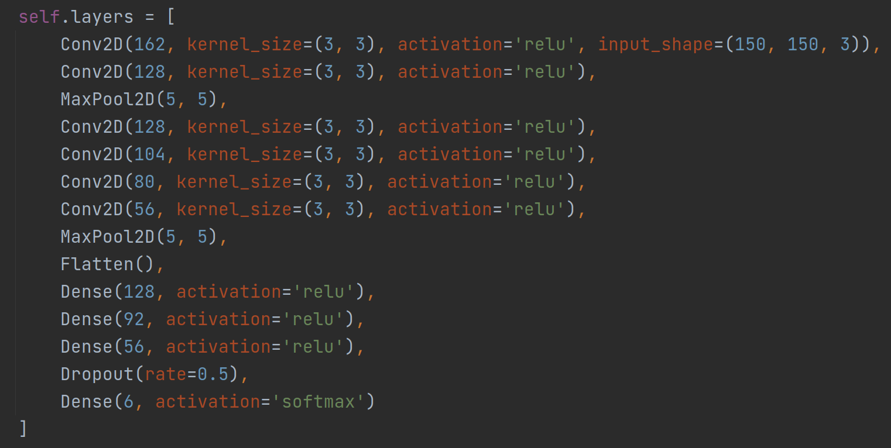
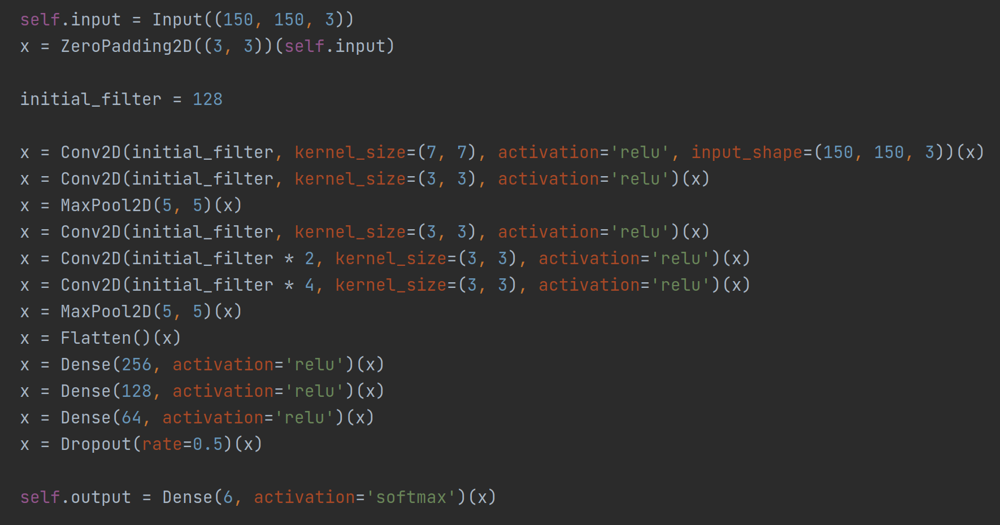
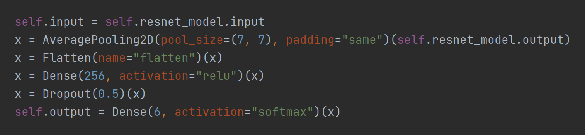
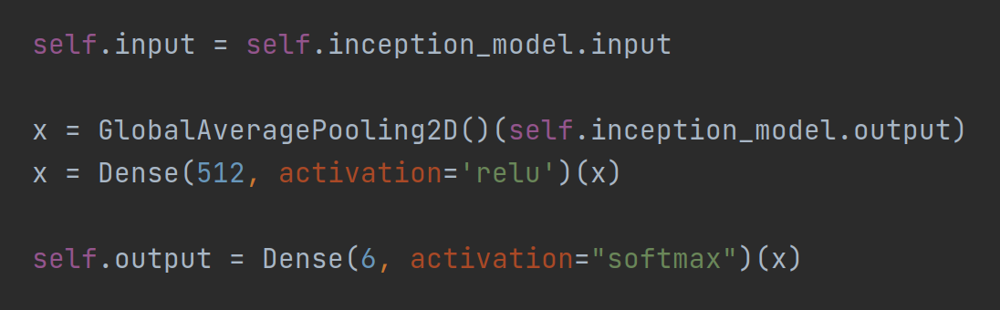

# Intel image classification

### Author: Damir Hadzic  

### Subject: Neural network

## Goal

Train set contains 14000 images.  

Test set contains 2500 images.  

Total number of classes is 6 (mountain, street, glacier, buildings, sea, forest).  

Train a neural network model with high success rate in class prediction of given image.  

## Packages

Package versions:  
* tensorflow - __*2.8.2*__  
* opencv - __*4.6.0.66*__  
* matplotlib - __*3.5.3*__

## Models

Models can be downloaded from [this link](https://drive.google.com/file/d/1blxW5WsyfxlvYk8Cu98vKYMVIiS9PNwA/view?usp=sharing). Once downloaded and extracted, all of the models located inside need to be copied into `models` directory.

* **Simple CNN 1** (`models/simple-14k-71p`)

Model trained on basic dataset. Architecture is shown above. Number of epoches is 20. Accuracy of given model is **71.6%**

* **Simple CNN 2** (`models/simple-18k-70p`)

Model trained on basic dataset + noise images created on 25% of the dataset. Same architecture is used as in previous model. Number of epoches is 30 for this dataset. Accuracy of given model is **70.8%**

* **Simple CNN 3** (`models/simple-21k-70p`)

Model trained on basic dataset + augmentated images created on 50% of the dataset. Architecture is shown above. Number of epoches is 24 for this dataset. Accuracy of given model is **70.7%**

* **ResNet50 1** (`models/resnet-fine50-14k-79p`)

Model trained on basic dataset. Architecture is pretrained ResNet50 model with some additional layers shown above. Number of epoches is 10. Accuracy of given model is **79.2%**

* **ResNet50 2** (`models/resnet-fine50-21k-78p`)

Model trained on basic dataset + augmentated images created on 50% of the dataset. Same architecture is used as in previous model. Number of epoches is 10. Accuracy of given model is **78.7%**

* **ResNet152** (`models/resnet-fine152-21k-80p`)

Model trained on basic dataset + augmentated images created on 50% of the dataset. Architecture is pretrained ResNet152 model with some additional layers shown above. Number of epoches is 20. Accuracy of given model is **80.2%**

* **InceptionV3** (`models/inception-fine-21k-71p`)

Model trained on basic dataset + augmentated images created on 50% of the dataset. Architecture is pretrained InceptionV3 model with some additional layers shown above. Number of epoches is 20. Accuracy of given model is **70.9%**
